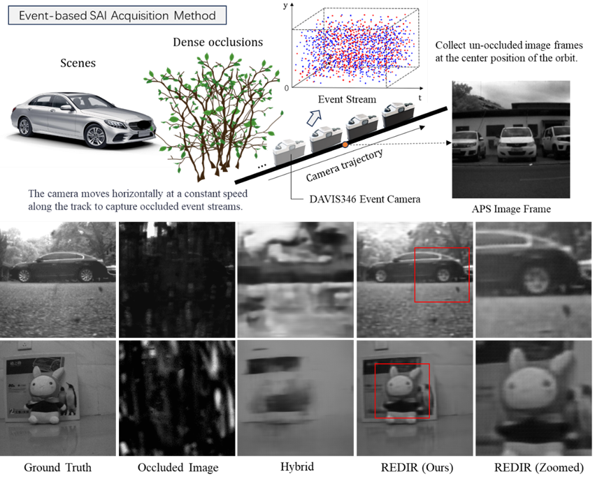
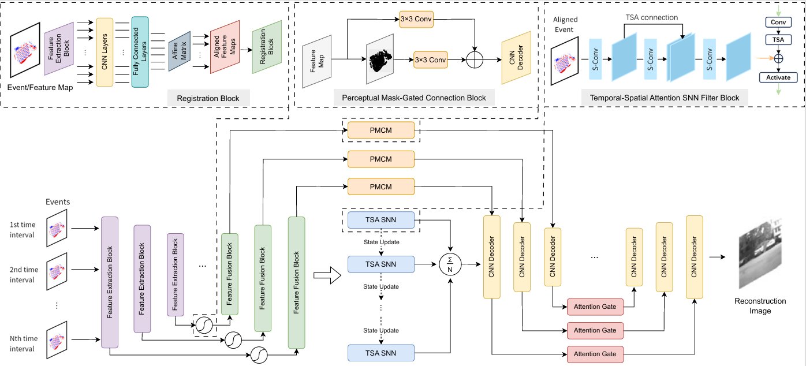
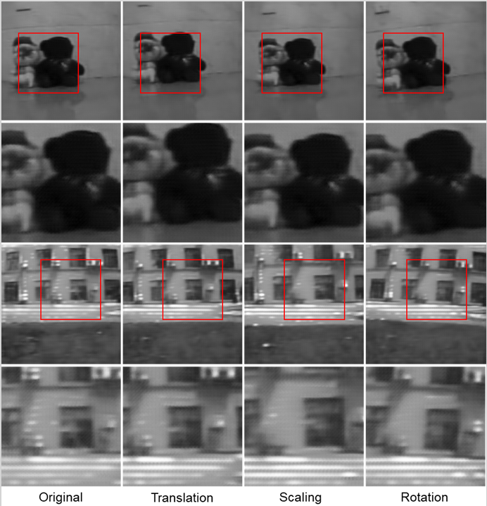

# REDIR
The employment of the event-based synthetic aperture imaging (E-SAI) technique, which has the capability to capture high-frequency light intensity varia-
tions, has facilitated its extensive application on scene de-occlusion reconstruction tasks. However, existing methods usually require prior information and have strict
restriction of camera motion on SAI acquisition methods.
<p align="center">

</p>
This paper proposes a novel end-to-end refocus-free variable E-SAI de-occlusion image reconstruction
approach REDIR, which can align the global and local features of the variable event data and effectively achieve high-resolution imaging of pure event streams.
To further improve the reconstruction of the occluded target, we propose a perceptual mask-gated connection module to interlink information between modules, and
incorporate a spatial-temporal attention mechanism into the SNN block to enhance target extraction ability of the model. (ps: the code's network structure is slightly different from our ECCV paper.)
<p align="center">

</p>
Through extensive experiments, our model REDIR achieves state-of-the-art reconstruction quality on the traditional E-SAI dataset, while verifying the effectiveness of the variable event data feature registration
method on our newly introduced V-ESAI dataset, which obviates the reliance on prior knowledge and extends the applicability of SAI acquisition methods by
incorporating focus changes, lens rotations, and non-uniform motion.


## Environment setup
- Python 3.11
- Pytorch 2.0.1
- torchvision 0.15.2
- opencv-python 4.4.0
- NVIDIA GPU + CUDA
- numpy, argparse, matplotlib
- [sewar](https://github.com/andrewekhalel/sewar), [lpips](https://github.com/richzhang/PerceptualSimilarity) (for evaluation, optional)

You can create a new Anaconda environment redir with the above dependencies as follows.

```
conda create -n redir python=3.11
conda activate redir
pip install torch==2.0.1+cu117 torchvision==0.15.2+cu117 -f https://download.pytorch.org/whl/torch_stable.html
pip install -r requirements.txt
```

## V-ESAI dataset
We construct a new multi-variable transformed data augmentation method to compile Variable E-SAI (V-ESAI) dataset, which is formed by data enhancement based on the E-SAI dataset collected by the DAVIS346 camera through random affine transform operations such as rotation, scaling, and translation. It imitates the lens rotation, focal length change, and perspective change during the actual SAI acquisition process. 
<div align=center>  </div>
This can improve the generalization ability of the model. The E-SAI dataset contains 488 groups of indoor scenes and 100 groups of outdoor scenes with occlusion E-SAI event data, each group of data is divided by 30 timestamps. V-ESAI dataset includes the original data and the above three random transformations for each E-SAI dataset sample group, expanded to 1,952 indoor groups and 400 outdoor groups, for a total of 2352 groups.

You can access and download our V-ESAI dataset, which is available at https://drive.google.com/file/d/1Sx_pikaAg--ix6W1_AdNzsVa4rRZovXF/view?usp=drive_link

### V-ESAI Dataset Generation (Random Variable Transformation)
- Run Preprocess_Transformation.py on E-SAI dataset raw. Put all samples in ./SAIDataset/Raw/ folder.
```
python Preprocess_Transformation.py --input_path=./SAIDataset/Raw/ --save_path=./Processed-V/
```
### Train REDIR Model
```
python codes/Train_REDIR.py -i Example_data/Processed-V/Train -rc PreTraining/STNHybrid.pt
```
### Test REDIR Model
```
python codes/Test_REDIR.py --reconNet=./PreTraining/STNHybrid.pt --registrationNet=./PreTraining/YourtrainedNet.pth --input_path=./Example_data/Processed-V/test --save_path=./Results-V/
```
RegistrationNet is trained based on E-SAI dataset or V-ESAI dataset.

### Evaluation
Evaluate the de-occlusion reconstruction results of PSNR, SSIM and LPIPS.
```
python Evaluation.py --input_path=./Results-V/
```

